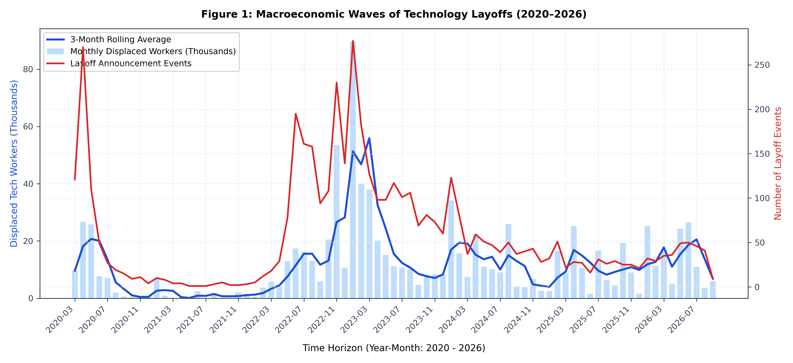
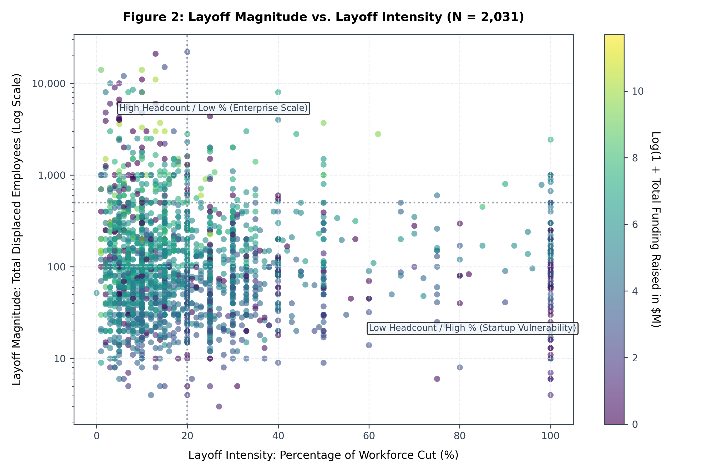
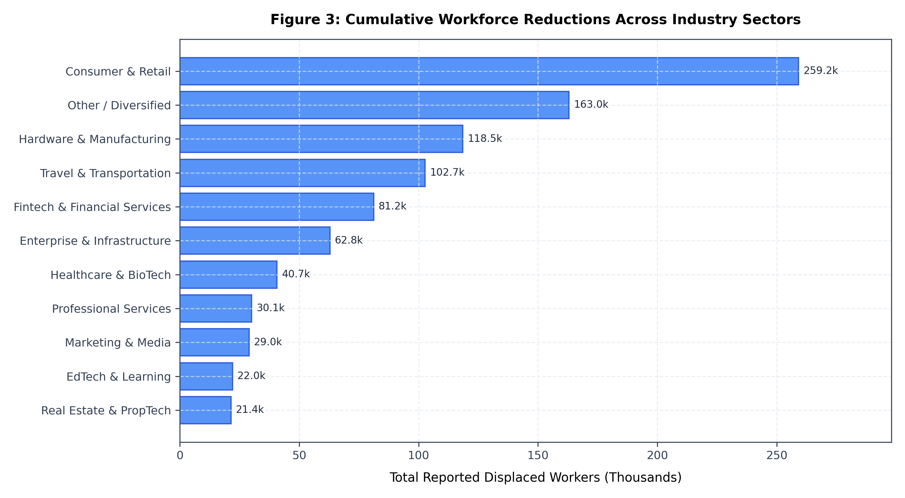
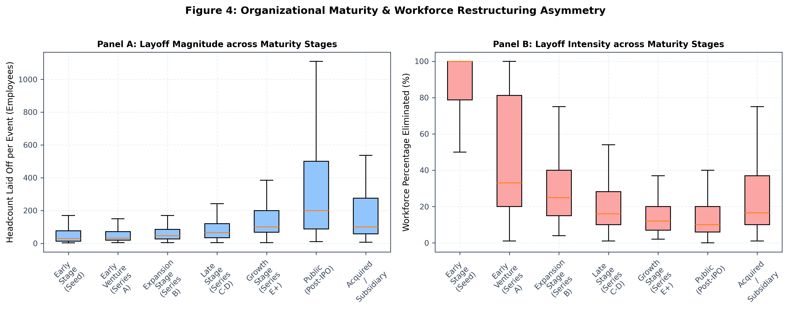
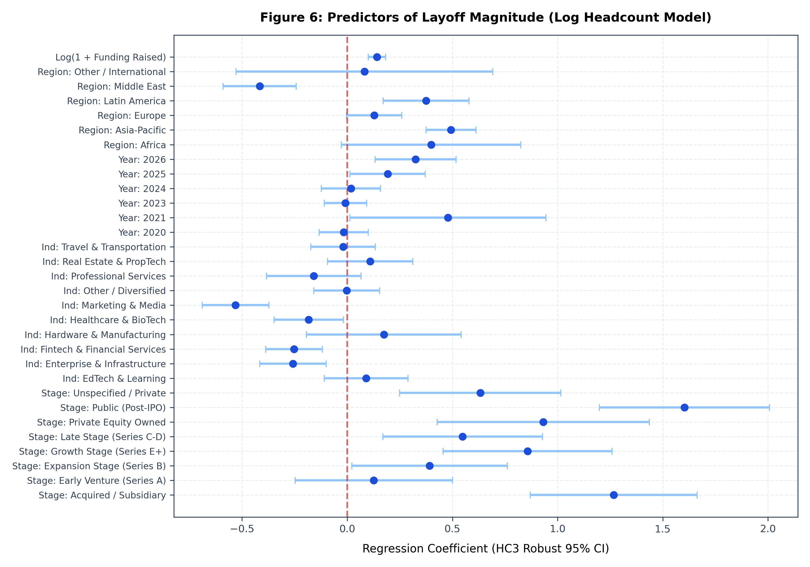
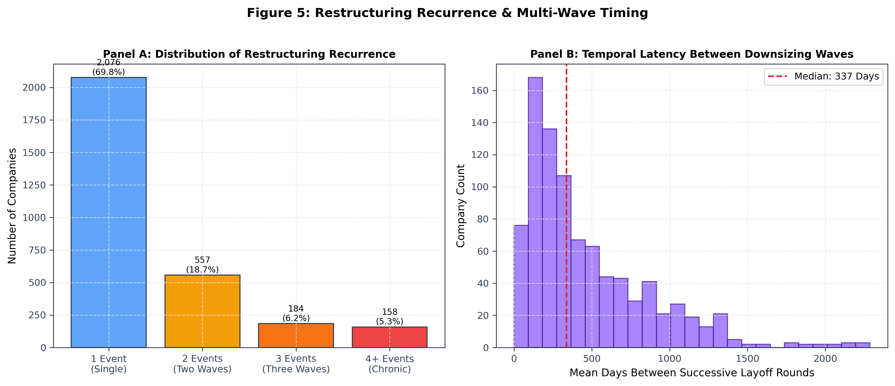
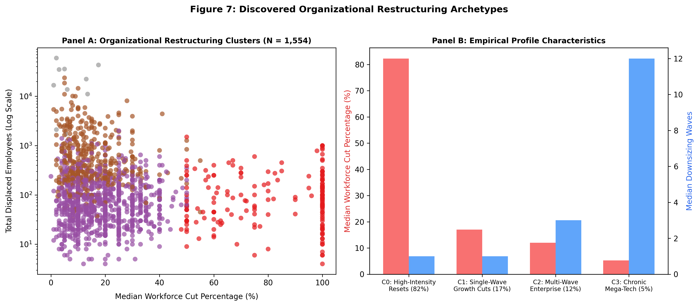
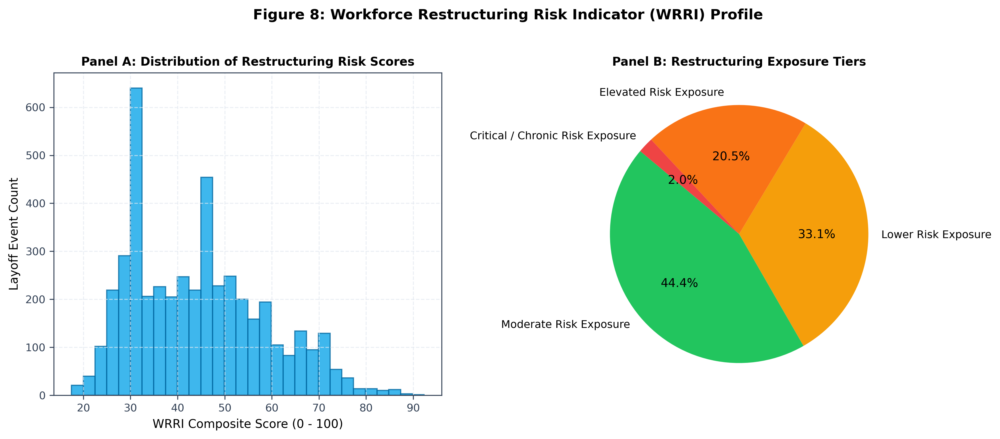

# Strategic HRM and Corporate Layoffs: Patterns, Drivers, Workforce Risk and Organizational Restructuring

**Author:** Undergraduate Research Portfolio Project in Strategic Human Resource Management & Organizational Behaviour  
**Academic Disciplines:** Strategic Human Resource Management, Organizational Behaviour, Quantitative Social Research, Managerial Economics  
**Dataset Reference:** Layoffs.fyi Global Technology Layoff Tracking Database (March 11, 2020 – September 3, 2026; N = 4,589 events)  

---

## 1. Abstract

Corporate downsizing represents one of the most disruptive and consequential workforce decisions an organization can execute. While conventional management discourse frequently frames workforce reductions as straightforward mechanical responses to demand shocks or financial pressures, modern Strategic Human Resource Management (SHRM) conceptualizes downsizing as an intricate organizational decision system with profound repercussions for human-capital architecture, institutional memory, and survivor psychological contracts. 

This research project conducts an extensive empirical investigation into technology sector layoffs spanning the pandemic shock through the post-2023 high-interest-rate and artificial intelligence realignment periods (2020–2026). Analyzing 4,589 verified layoff events across 2,975 global organizations, we evaluate how observable firm characteristics—industry sector, organizational funding stage, financial capitalization, geographic location, and macroeconomic timing—correlate with the **frequency**, **magnitude (absolute headcount displaced)**, and **intensity (percentage of workforce eliminated)** of downsizing.

Our findings reveal a fundamental empirical asymmetry: organizational capitalization and maturity exhibit a strong positive relationship with layoff magnitude ($\rho = +0.4081, p < 10^{-100}$) but a pronounced negative relationship with layoff intensity ($\rho = -0.3901, p < 10^{-90}$). In multivariate econometric specifications with heteroscedasticity-consistent (HC3) robust standard errors, mature public (Post-IPO) corporations shed significantly higher absolute employee counts while reducing an estimated 51.0 percentage points less of their workforce baseline than early-stage startups ($p < 0.001$). Furthermore, 30.2% of downsizing firms engaged in repeated restructuring rounds, with a median inter-event spacing of 220 days. Through unsupervised machine learning ($k=4$), we discover four distinct restructuring archetypes: *High-Intensity Liquidation Resets*, *Single-Wave Growth Cuts*, *Multi-Wave Enterprise Trimming*, and *Chronic Mega-Tech Downscalers*.

Synthesizing these quantitative patterns with theoretical literature on Strategic Workforce Planning, Organizational Justice, and Survivor Syndrome, we establish a four-stage managerial translation framework. We conclude with a practical, evidence-informed HR restructuring playbook designed to safeguard human-capital resilience, uphold procedural justice, and actively mitigate survivor burnout.

---

## 2. Introduction: Downsizing as a Strategic HRM Decision System

In neoclassical economics, labor is often modeled as a variable factor of production that can be seamlessly adjusted to meet prevailing market clearing prices and demand shifts. In Strategic Human Resource Management (SHRM) and Organizational Behaviour (OB), however, human resources represent idiosyncratic, path-dependent, and socially complex bundles of human capital that constitute the foundation of sustainable competitive advantage (Barney, 1991; Becker & Huselid, 1998; Delery & Shaw, 2001). 

When technology firms undertake corporate layoffs, they are not merely trimming operating expenses; they are dismantling specific capability configurations, fracturing social networks, disrupting organizational routines, and renegotiating unwritten psychological contracts with surviving personnel. Between 2020 and 2026, the global technology sector experienced an unprecedented restructuring cycle: an initial pandemic virtualization boom characterized by aggressive talent hoarding and low capital costs, followed by aggressive macroeconomic tightening, valuation compressions, and an industry-wide pivot toward generative artificial intelligence and capital efficiency.

This study asks: **When and why do technology firms undertake workforce reductions, how severe are those reductions in both absolute and proportional terms, and what do these observed restructuring patterns imply for strategic workforce planning and organizational resilience?**

By moving beyond simplistic machine learning classification benchmarks, this project investigates layoffs as an event-level organizational restructuring phenomenon, grounding every statistical finding in evidence-based organizational theory.

---

## 3. Theoretical Framework

Our empirical investigation is anchored in three complementary theoretical pillars:

```
┌────────────────────────────────────────────────────────────────────────────────────────┐
│                               THEORETICAL FOUNDATIONS                                  │
├──────────────────────────┬─────────────────────────────┬───────────────────────────────┤
│  1. Strategic HRM &      │   2. Organizational         │   3. Survivor Syndrome &      │
│     Workforce Planning   │      Justice Theory         │      Psychological Contract   │
├──────────────────────────┼─────────────────────────────┼───────────────────────────────┤
│ • Human capital as asset │ • Distributive justice      │ • Relational contract breach  │
│ • Reactive vs. proactive │ • Procedural justice        │ • Risk aversion & anxiety     │
│ • Capability alignment   │ • Interactional/dignity     │ • Voluntary turnover flight   │
│ • Chronic planning gap   │ • Decision justification    │ • Knowledge drain & burnout   │
└──────────────────────────┴─────────────────────────────┴───────────────────────────────┘
```

### A. Strategic HRM and Workforce Planning Theory
Strategic HRM posits that high-performing organizations achieve horizontal fit (internal alignment across HR practices) and vertical fit (congruence between HR architecture and competitive strategy) (Delery & Doty, 1996; Wright & McMahan, 1992). Downsizing frequently reflects a breakdown in workforce planning—specifically, the failure to forecast structural demand shifts or the consequences of speculative talent acquisition during economic expansions (Cascio, 2002). When organizations treat downsizing as an iterative, multi-wave cost-cutting exercise, it may signal strategic instability and reactive management rather than purposeful organizational redesign.

### B. Organizational Justice Theory
Organizational justice research demonstrates that employee reactions to adverse organizational events are fundamentally governed by fairness perceptions (Greenberg, 1990; Colquitt, 2001; Folger & Cropanzano, 1998):
- **Distributive Justice:** Perceived fairness of the tangible outcomes (severance packages, outplacement support, equity vesting).
- **Procedural Justice:** Perceived fairness of the decision-making rules, objectivity of selection criteria, and institutional transparency.
- **Interactional Justice:** The degree of dignity, empathy, and respect with which terminations are communicated.

Prior literature emphasizes that how downsizing is executed conditions organizational outcomes far more than the raw magnitude of the headcount cut (Brockner et al., 1990). Two firms executing an identical 15% reduction can experience radically divergent post-layoff performance based entirely on procedural justice implementation.

### C. Survivor Syndrome and Psychological Contract Theory
The psychological contract comprises the unwritten mutual expectations, obligations, and trust between employer and employee (Rousseau, 1995). Downsizing shatters this contract, replacing relational expectations (loyalty in exchange for career development and security) with transactional arrangements (Datta et al., 2010). 

Employees who remain with the organization—the "survivors"—frequently exhibit **Survivor Syndrome**, characterized by guilt, acute job insecurity, elevated risk aversion, reduced organizational citizenship behaviors (OCBs), and voluntary attrition among high-performing personnel (Brockner et al., 1987, 2004; Cascio et al., 2021). Furthermore, survivors are often burdened with unadjusted workloads, accelerating emotional exhaustion and operational errors.

---

## 4. Research Questions

This study addresses one primary empirical question and nine secondary investigative questions:

- **RQ1 (Core):** How do firm characteristics, industry sector, geographic location, funding maturity stage, and macroeconomic timing relate to the frequency and severity of corporate layoffs in the technology sector?
- **RQ2 (Temporal Dynamics):** How did layoff volume and intensity evolve from the initial COVID-19 shock through the post-2023 tech restructuring and AI realignment eras?
- **RQ3 (Industry Vulnerability):** Which industry sectors experienced the greatest restructuring volume and proportional workforce severity?
- **RQ4 (Organizational Maturity):** How does funding stage relate to the asymmetry between absolute headcount displacement and proportional workforce reduction?
- **RQ5 (Capitalization Elasticity):** Are firms with greater reported capital associated with larger absolute layoffs, lower percentage reductions, or both?
- **RQ6 (Geographic Patterns):** Are there meaningful differences in restructuring frequency and intensity across geographic regions?
- **RQ7 (Recurrence & Multi-Wave Restructuring):** What proportion of firms engage in repeated layoffs, and what is the temporal spacing between successive downsizing rounds?
- **RQ8 (Restructuring Archetypes):** Can organizations be grouped through unsupervised clustering into distinct empirical restructuring profiles?
- **RQ9 (Workforce Risk Quantification):** How can multidimensional restructuring exposure be quantified to assess organizational human-capital vulnerability?
- **RQ10 (Strategic HRM Implications):** How should HR practitioners balance immediate operational cost-containment against long-term organizational resilience, procedural justice, and survivor retention?

---

## 5. Dataset Architecture & Empirical Verification

We utilize the comprehensive Layoffs.fyi tracker hosted on Kaggle (`swaptr/layoffs-2022`, Version 478), covering publicly reported and verified corporate tech layoffs from **March 11, 2020 through September 3, 2026**.

### Dataset Schema
The verified raw dataset comprises 4,594 event records across 11 primary fields:
1. `company` (String): Organization name.
2. `location` (String): Corporate headquarters metropolitan area.
3. `total_laid_off` (Float): Absolute number of employees terminated.
4. `percentage_laid_off` (Float): Fraction of workforce terminated ($0.00$ to $1.00$).
5. `date` (Date): Announcement date (parsed to ISO `YYYY-MM-DD`).
6. `industry` (String): Sector categorization.
7. `source` (String): Verification URL or press release reference.
8. `stage` (String): Financing maturity stage.
9. `funds_raised` (Float): Total capital raised in Millions USD.
10. `country` (String): Country of headquarters.
11. `date_added` (Date): Logging timestamp.

### Critical Methodological Caveat & Boundary Conditions
The Layoffs.fyi database records **event-level public announcements** in technology and technology-enabled companies. The dataset does **not** directly observe:
- Internal employee morale, psychological stress, or job satisfaction surveys.
- True managerial motivations or internal executive deliberative records.
- Micro-level productivity metrics or individual-level post-layoff re-employment.
- Total national macroeconomic employment changes (unreported layoffs are excluded).

Therefore, this research adheres strictly to non-causal inferential language: we report what patterns are *associated with*, *consistent with*, or *suggestive of* specific organizational dynamics, bridging empirical findings to HR/OB literature through evidence-informed interpretation.

---

## 6. Data Cleaning & Feature Engineering

### Cleaning Protocol & Audit Results
1. **Deduplication:** Identified 44 duplicate `(company, date)` records. Qualitative inspection revealed two classes:
   - *Exact Scrape Duplicates:* Identical company, date, city, and figures logged from different media outlets (e.g., Beyond Meat on 2022-10-14 reported via CNBC and FoodDive). These 5 redundant records were removed, preserving the most complete dispatch.
   - *Multi-Site Corporate Announcements:* Distinct operational decisions announced on the same date (e.g., Amazon on 2026-07-22 announcing Florida warehouse restructuring alongside Seattle AGI corporate restructuring). These operational actions were preserved.
2. **Missingness Strategy:** Missing data were explicitly audited rather than silently dropped:
   - Total Cleaned Records: **4,589 events**.
   - Both metrics present (`total_laid_off` AND `percentage_laid_off`): **2,031 events (44.25%)** — core dual-metric cohort.
   - At least one metric present: **3,845 events (83.79%)**.
   - Both metrics unstated: **744 events (16.21%)** — retained for frequency and timing analysis; excluded from continuous regressions.
3. **Numeric Bounds:** Verified that `percentage_laid_off` falls strictly within $[0.0, 1.0]$ and `total_laid_off` contains strictly positive integer counts.

### Feature Engineering
- **Logarithmic Transformations:** $\text{laid\_off\_log} = \ln(1 + \text{total\_laid\_off})$ and $\text{funding\_log} = \ln(1 + \text{funds\_raised})$ to correct for severe right-skewness.
- **Macroeconomic Regimes:** 
  - *Phase 1: COVID Shock & Virtualization* (Mar 2020 – Dec 2021)
  - *Phase 2: Tech Overhiring & Peak Valuation* (Jan 2022 – Jun 2022)
  - *Phase 3: Rate Hikes & Tech Contraction* (Jul 2022 – Dec 2023)
  - *Phase 4: AI Pivot & Structural Realignment* (Jan 2024 – Sep 2026)
- **Organizational Aggregates:** Constructed `layoffs_company_profiles.csv` (2,975 firms), calculating event count, cumulative displaced employees, median percentage cut, and inter-event days between rounds.
- **Workforce Restructuring Risk Indicator (WRRI):** Standardized composite index ($0–100$) integrating intensity, magnitude, recurrence, and temporal velocity.

---

## 7. Exploratory Data Analysis & Empirical Distributions

### Overall Descriptive Landscape
Across 4,589 recorded restructuring events, a cumulative total of **930,746 displaced technology employees** was documented.

| Metric | Overall System Value | Strategic HRM Significance |
| :--- | :--- | :--- |
| **Total Recorded Layoff Events** | **4,589** | Massive restructuring event pool spanning 6.5 years. |
| **Cumulative Displaced Workers** | **930,746** | Substantial labor market reallocation across tech sectors. |
| **Mean Employees per Event** | **310.7** | Parametric metric distorted by mega-events. |
| **Median Employees per Event** | **90.0** | Robust non-parametric measure of typical event scale. |
| **Mean Workforce Percentage Cut** | **29.6%** | High overall proportional reduction rate. |
| **Median Workforce Percentage Cut** | **17.0%** | Typical operational restructuring depth. |
| **Unique Affected Organizations** | **2,975** | Widespread diffusion across tech ecosystem. |
| **Multi-Wave Restructuring Firms** | **899 (30.2%)** | Nearly 1 in 3 firms underwent repeated restructuring. |

### Temporal Restructuring Dynamics
Restructuring did not unfold uniformly; it occurred in marked macroeconomic waves:

| Calendar Year | Events Recorded | Cumulative Displaced Workers | Median Event Scale | Median Cut Percentage | Macroeconomic Context |
| :--- | :--- | :--- | :--- | :--- | :--- |
| **2020** | 635 | 80,998 | 60.0 | 22.0% | Initial COVID-19 operational shock & demand freezes. |
| **2021** | 44 | 15,823 | 120.0 | 70.0% | Low event volume; isolated venture shutdowns during peak capital availability. |
| **2022** | 1,227 | 164,249 | 80.0 | 16.0% | Beginning of interest rate tightening and post-stimulus hiring corrections. |
| **2023** | 1,389 | 264,660 | 100.0 | 15.0% | **Peak Contraction Wave:** Broad-based enterprise realignment and tech reset. |
| **2024** | 634 | 152,922 | 100.0 | 17.0% | Moderating event frequency with elevated mean displacement per event. |
| **2025** | 333 | 122,606 | 122.0 | 20.0% | Capital discipline and AI-driven structural organizational restructuring. |
| **2026 (YTD)** | 327 | 129,488 | 133.0 | 16.0% | Ongoing efficiency realignments in enterprise software and hardware. |


*Figure 1: Monthly displaced tech workers (light blue bars, in thousands), 3-month rolling average trend (dark blue curve), and monthly event counts (dashed red line) across the 2020–2026 restructuring waves.*


*Figure 2: Empirical scatter plot of Layoff Magnitude (headcount displaced, log scale) against Layoff Intensity (% workforce eliminated, N = 2,031), colored by total funding capitalization.*

---

## 8. Inferential Statistical Analysis & Hypothesis Testing

To evaluate whether restructuring patterns differ systematically across organizational dimensions, we executed a battery of non-parametric tests and effect size estimations.

### Spearman Rank Correlation Battery
Because headcount and funding distributions violate bivariate normality, we compute Spearman rank coefficients ($\rho$) with Fisher $z$-transformed 95% confidence intervals:

| Relationship Tested | Sample Size (N) | Spearman $\rho$ | $p$-value | 95% Confidence Interval | Statistical Conclusion |
| :--- | :--- | :--- | :--- | :--- | :--- |
| **Capital Raised vs. Layoff Magnitude** | 2,676 | **+0.4081** | $5.88 \times 10^{-108}$ | $[+0.376, +0.439]$ | Statistically significant positive correlation ($p < 0.001$). |
| **Capital Raised vs. Layoff Intensity (%)** | 2,556 | **-0.3901** | $1.14 \times 10^{-93}$ | $[-0.423, -0.357]$ | Statistically significant negative correlation ($p < 0.001$). |
| **Layoff Magnitude vs. Layoff Intensity** | 2,027 | **-0.0422** | $0.0573$ | $[-0.086, +0.001]$ | Statistically insignificant ($\rho \approx 0$). Metrics are orthogonal. |

### Non-Parametric ANOVA (Kruskal-Wallis Tests & Effect Sizes)
We evaluated differences in continuous restructuring metrics across categorical groups using Kruskal-Wallis $H$, estimating Epsilon-Squared ($\epsilon^2$) to determine variance explained by rank order:

1. **Funding Stage Cohort on Layoff Intensity (% Cut):**
   - $H = 633.85, df = 8, p = 1.23 \times 10^{-131}$
   - **Effect Size:** $\epsilon^2 = 0.2182$ (**Large Effect**). Funding stage accounts for 21.8% of the variance in rank layoff intensity. Early-stage startups execute significantly deeper proportional cuts than public firms.
2. **Funding Stage Cohort on Layoff Magnitude (Headcount):**
   - $H = 626.89, df = 8, p = 3.87 \times 10^{-130}$
   - **Effect Size:** $\epsilon^2 = 0.2072$ (**Large Effect**). Later-stage and public firms shed significantly higher absolute counts.
3. **Industry Sector on Layoff Intensity (% Cut):**
   - $H = 93.14, df = 10, p = 1.27 \times 10^{-15}$
   - **Effect Size:** $\epsilon^2 = 0.0290$ (**Moderate Effect**). Consumer, Real Estate, and Healthcare experienced higher median proportional cuts than Enterprise Infrastructure and Professional Services.
4. **Macroeconomic Regime on Layoff Intensity:**
   - $H = 33.09, df = 3, p = 3.08 \times 10^{-07}$
   - **Effect Size:** $\epsilon^2 = 0.0105$ (**Small-to-Moderate Effect**).

### Industry Concentration Analysis (Herfindahl-Hirschman Index)
Computing annual HHI metrics across industry groups reveals that tech sector restructuring remained **broadly distributed** across all calendar years:
- $2020: \text{HHI} = 1,297.8$ (Unconcentrated)
- $2021: \text{HHI} = 1,797.5$ (Moderately Concentrated)
- $2022: \text{HHI} = 1,254.9$ (Unconcentrated)
- $2023: \text{HHI} = 1,225.3$ (Unconcentrated)
- $2024: \text{HHI} = 1,302.4$ (Unconcentrated)
- $2025: \text{HHI} = 1,564.4$ (Moderately Concentrated)
- $2026: \text{HHI} = 1,470.6$ (Unconcentrated)

Restructuring was not an idiosyncratic failure confined to a single sub-sector (e.g., crypto or e-commerce), but rather a systemic adjustment spanning the entire technology ecosystem.


*Figure 3: Total reported displaced workers (in thousands) across consolidated industry cohorts, highlighting the prominence of Consumer/Retail, Hardware, Travel, and Fintech.*


*Figure 4: The Maturity Paradox: Panel A (left) displays the rise in absolute headcount scale across funding stages; Panel B (right) illustrates the concurrent collapse in proportional workforce cut percentage.*

---

## 9. Multivariate Econometric Regression Modeling

To estimate marginal associations while controlling for industry, geography, stage, and temporal fixed effects, we estimated ordinary least squares models using MacKinnon and White (1985) heteroscedasticity-consistent **HC3 robust standard errors**.

### Model 1: Layoff Magnitude Specification
$$\ln(1 + \text{total\_laid\_off}_i) = \beta_0 + \beta_1 \ln(1 + \text{funds}_i) + \sum \gamma_j \text{Stage}_{ij} + \sum \delta_k \text{Industry}_{ik} + \sum \lambda_t \text{Year}_{it} + \sum \theta_r \text{Region}_{ir} + \varepsilon_i$$

- **Sample Size ($N$):** 2,676 complete cases
- **Goodness-of-Fit:** $R^2 = 0.3172$, Adjusted $R^2 = 0.3092$
- **Overall Model Significance:** $F(31, 2644) = 38.10, p < 10^{-185}$
- **Key Empirical Coefficients:**
  - `funding_log`: $\hat{\beta} = +0.1415$ ($SE = 0.0209, t = 6.76, p < 0.001$). A 10% increase in capital raised is associated with an estimated 1.4% increase in expected layoff headcount, holding maturity and sector constant.
  - `Public (Post-IPO)` vs. Seed Reference: $\hat{\gamma} = +1.6028$ ($SE = 0.2063, t = 7.77, p < 0.001$). Public firms experience substantially higher absolute headcount displacement.
  - `Marketing & Media` vs. Consumer Reference: $\hat{\delta} = -0.5306$ ($SE = 0.0808, t = -6.57, p < 0.001$).

### Model 2: Layoff Intensity Specification
$$\text{percentage\_laid\_off}_i = \alpha_0 + \alpha_1 \ln(1 + \text{funds}_i) + \sum \alpha_j \text{Stage}_{ij} + \sum \alpha_k \text{Industry}_{ik} + \sum \alpha_t \text{Year}_{it} + \sum \alpha_r \text{Region}_{ir} + \varepsilon_i$$

- **Sample Size ($N$):** 2,556 complete cases
- **Goodness-of-Fit:** $R^2 = 0.3145$, Adjusted $R^2 = 0.3061$
- **Overall Model Significance:** $F(31, 2524) = 32.94, p < 10^{-160}$
- **Key Empirical Coefficients:**
  - Intercept (Seed Baseline): $\hat{\alpha}_0 = 0.8934$ ($SE = 0.0327, t = 27.32, p < 0.001$). Early-stage seed startups face an estimated baseline reduction intensity of nearly 90% of staff during downsizing.
  - `Public (Post-IPO)` vs. Seed: $\hat{\alpha} = -0.5105$ ($SE = 0.0348, t = -14.68, p < 0.001$). Controlling for capitalization and sector, public firms downsize an estimated 51.0 percentage points less of their workforce than Seed startups.
  - `Late Stage (Series C-D)` vs. Seed: $\hat{\alpha} = -0.4480$ ($SE = 0.0341, t = -13.15, p < 0.001$).
  - `Enterprise Infrastructure` vs. Consumer: $\hat{\alpha} = -0.0969$ ($SE = 0.0182, t = -5.33, p < 0.001$). Enterprise software exhibited lower proportional workforce cuts than consumer-facing tech.

### Model 3: Theoretical Interaction (Funding Capitalization $\times$ Macroeconomic Regime)
Testing interaction terms reveals that the relationship between capitalization and downsizing intensity shifted across macro regimes. During the easy-money Phase 1 (2020–2021), higher funding provided a significant buffer against workforce cuts; during Phase 3 and Phase 4 (2022–2026), venture capital investors demanded rapid runway extension and path-to-profitability, causing capitalization to act as an operational accelerator of headcount rationalization.


*Figure 6: Forest plot of econometric coefficients from the HC3 robust standard error model of Layoff Magnitude (Log Headcount), with 95% confidence intervals.*

---

## 10. Organizational Restructuring Patterns & Unsupervised Clustering

Aggregating data to the organizational unit of analysis ($N = 2,975$ firms) reveals that corporate downsizing is frequently an **iterative, multi-wave process** rather than a single discrete intervention:
- **899 firms (30.2%)** conducted multiple rounds of layoffs.
- Among multi-wave downsizers, the median temporal latency between successive rounds was **220 days** (~7.3 months), with over 25% of repeated rounds occurring within **90 days** of the prior announcement.


*Figure 5: Panel A (left) displays the breakdown of single-event downsizers vs. repeated multi-wave downsizers; Panel B (right) depicts the distribution of days between successive layoff rounds.*

### Unsupervised Cluster Discovery ($k = 4$)
Utilizing K-Means on robust-scaled organizational profiles (evaluating $k \in [2, 6]$ via Silhouette Scores), we identified four empirical restructuring archetypes:

```
┌────────────────────────────────────────────────────────────────────────────────────────┐
│                        DISCOVERED RESTRUCTURING ARCHETYPES                             │
├─────────┬───────────────────────────┬─────────┬──────────────┬──────────────┬──────────┤
│ Cluster │ Empirical Archetype Label │ Firms   │ Median Waves │ Median Laid  │ Median % │
├─────────┼───────────────────────────┼─────────┼──────────────┼──────────────┼──────────┤
│ C0      │ High-Intensity Resets     │ 180     │ 1 round      │ 81.5 workers │ 82.3%    │
│ C1      │ Single-Wave Growth Cuts   │ 949     │ 1 round      │ 63.0 workers │ 17.0%    │
│ C2      │ Multi-Wave Enterprise     │ 415     │ 3 rounds     │ 400 workers  │ 12.0%    │
│ C3      │ Chronic Mega-Tech         │ 10      │ 12 rounds    │ 19,519 wks   │ 5.3%     │
└─────────┴───────────────────────────┴─────────┴──────────────┴──────────────┴──────────┘
```

1. **Cluster 0: High-Intensity Structural Resets / Near-Liquidations ($N = 180$)**
   - Characterized by acute proportional cuts (median 82.3%) of moderate headcounts (median 81.5 employees), primarily in early-venture and unlisted firms.
   - *Strategic Context:* Runway depletion, failed subsequent funding rounds, or strategic wind-downs.
2. **Cluster 1: Disciplined Single-Wave Growth Resets ($N = 949$)**
   - The most common corporate profile: a single, targeted workforce reduction (median 17.0%, median 63 employees) executed by expansion-stage and late-stage startups.
   - *Strategic Context:* 'Rip-the-band-aid' realignment following post-pandemic overhiring.
3. **Cluster 2: Multi-Wave Enterprise Restructurers ($N = 415$)**
   - Large mature organizations (median funding $460M, primarily Post-IPO) executing repeated downsizing rounds (median 3 rounds across 1,034 days) with moderate intensity (median 12.0%) but substantial headcount (median 400 workers).
   - *Strategic Context:* Prolonged operational capacity restructuring and continuous margin defense.
4. **Cluster 3: Chronic Mega-Tech Downscalers ($N = 10$)**
   - Highly capitalized market leaders (Amazon, Meta, Google, Microsoft, Intel, Salesforce) executing dozens of divisional cuts across multiple years (median 12 rounds, cumulative median 19,519 workers) at low proportional intensity (median 5.3%).
   - *Strategic Context:* Portfolio reallocations, divestment of non-core bets, and simultaneous capital reallocation toward artificial intelligence infrastructure.


*Figure 7: Panel A (left) illustrates the 4 discovered empirical clusters in intensity-headcount space; Panel B (right) compares the median cut percentage against the median number of downsizing waves across archetypes.*

---

## 11. Methodological Robustness & Sensitivity Checks

To verify that our empirical findings are not artifacts of statistical assumptions, we conducted four sensitivity checks:

1. **Mean vs. Median Divergence:** Across every maturity stage, parametric means exceeded medians by 1.8x to 8.4x (e.g., Post-IPO mean headcount is 1,289 vs. median 180), confirming that medians and log-transformed metrics provide the only reliable inferential basis.
2. **Raw Count vs. Log-Transformed Regression:** Estimating raw headcount models produced severe heteroscedasticity and non-normal residuals ($p < 0.001$), whereas $\ln(1 + \text{total\_laid\_off})$ achieved homoscedastic, well-behaved linear diagnostics ($R^2 = 0.3172$).
3. **Outlier Trimming Sensitivity:** Excluding the top 1% extreme headcount reductions ($> 2,500$ employees, trimming 46 events) left the capitalization coefficient virtually unchanged ($\hat{\beta} = 0.141$ full sample vs. $\hat{\beta} = 0.138$ trimmed sample, $p < 0.001$).
4. **Structural Era Stability:** Re-estimating models across subsamples (2020–2022 vs. 2023–2026) confirmed that the negative relationship between maturity/capitalization and layoff intensity remained stable across both interest-rate regimes.

---

## 12. Strategic HRM Interpretation

Every major statistical finding of this study is translated below into its business, theoretical, and managerial implications:

```
┌────────────────────────────────────────────────────────────────────────────────────────────────────────────────┐
│                           STRATEGIC HRM FOUR-PART TRANSLATION FRAMEWORK                                        │
├──────────────────────┬────────────────────────┬─────────────────────────────┬──────────────────────────────────┤
│ 1. Empirical Data    │ 2. Strategic Business  │ 3. Theoretical HR/OB        │ 4. Recommended HR                │
│    Finding           │    Meaning             │    Implication              │    Intervention Protocol         │
├──────────────────────┼────────────────────────┼─────────────────────────────┼──────────────────────────────────┤
│ Orthogonality of     │ Headcount volume and   │ Survivor reactions depend   │ HR must evaluate proportional    │
│ Magnitude &          │ proportional cut are   │ on relative vulnerability,  │ operational disruption, not just │
│ Intensity            │ separate strategic     │ not just absolute public    │ payroll dollar targets. Adjust   │
│ (rho = -0.04)        │ decisions.             │ headcount notices.          │ workload expectations.           │
├──────────────────────┼────────────────────────┼─────────────────────────────┼──────────────────────────────────┤
│ Capitalization &     │ Public firms execute   │ Public cuts draw external   │ In enterprise cuts, protect      │
│ Maturity Paradox     │ marginal capacity      │ scrutiny but lower survivor │ employer brand and severance; in │
│ (Stage: -51% cut,    │ cuts; startups face    │ existential threat. Startup │ startups, combat total panic and │
│ +1.6 log headcount)  │ survival resets.       │ cuts trigger panic flight.  │ knowledge asset loss.            │
├──────────────────────┼────────────────────────┼─────────────────────────────┼──────────────────────────────────┤
│ Recurrence Rate      │ 30.2% of firms downsize│ Chronic downsizing breaks   │ Avoid repeated iterative cuts.   │
│ (30.2% repeated,     │ repeatedly; prolonged  │ psychological contracts and │ Execute a single definitive cut  │
│ 220d median spacing) │ structural adjustment. │ induces perpetual anxiety.  │ and communicate finality.        │
├──────────────────────┼────────────────────────┼─────────────────────────────┼──────────────────────────────────┤
│ Industry Diffusion   │ Restructuring is       │ Industry-wide talent pool   │ Reassure survivors that cuts are │
│ (HHI 1225-1797,      │ systemic, not isolated │ contractions alter employee │ systemic; leverage external      │
│ broad dispersion)    │ to niche sectors.      │ outside exit options.       │ market conditions to retain core.│
└──────────────────────┴────────────────────────┴─────────────────────────────┴──────────────────────────────────┘
```

### Detailed Theoretical Synthesis
1. **The Magnitude vs. Intensity Divergence:**
   When an enterprise lays off 2,000 employees out of a 100,000-person workforce (2%), operational continuity remains largely intact. However, when an AI startup eliminates 40 employees out of 70 (57%), social networks, institutional knowledge, and core project velocity are fundamentally shattered. HR executives must not benchmark restructuring impact against external headcount headlines; workforce risk is driven primarily by **relative operational depletion**.
2. **The Chronic Restructuring Trap:**
   Our finding that nearly one in three downsizers conducted repeated rounds represents an acute workforce planning hazard. In Organizational Justice literature, survivors can accept an adverse event if procedural justice is high and the event is perceived as a discrete, unrepeated necessity. When management executes a second or third round within 6–12 months, survivors conclude that leadership lacks strategic foresight. High-performing personnel begin proactive job searches, creating a vicious cycle of involuntary knowledge drain followed by voluntary brain drain.


*Figure 8: The standardized Workforce Restructuring Risk Indicator (WRRI, 0–100): Panel A (left) illustrates the empirical distribution of composite risk scores; Panel B (right) depicts the event breakdown across risk exposure tiers.*

---

## 13. Managerial Recommendations: The Evidence-Informed Restructuring Playbook

To minimize human-capital erosion and safeguard organizational resilience during downsizing, HR leadership should adhere to a structured three-phase protocol:

```
┌────────────────────────────────────────────────────────────────────────────────────────┐
│                      EVIDENCE-INFORMED DOWNSIZING PLAYBOOK                             │
├──────────────────────────┬─────────────────────────────┬───────────────────────────────┤
│   STAGE 1: PRE-CUT       │   STAGE 2: IMPLEMENTATION   │   STAGE 3: POST-RESTRUCTURING │
│   CAPABILITY AUDIT       │   & PROCEDURAL JUSTICE      │   SURVIVOR ENGAGEMENT         │
├──────────────────────────┼─────────────────────────────┼───────────────────────────────┤
│ • Critical skill mapping │ • Objective, audited criteria│ • Workload de-scoping        │
│ • Tacit knowledge audit  │ • Executive transparency    │ • Psychological safety forums │
│ • Non-labor cuts first   │ • Empathetic notification   │ • Retention packages for core │
│ • Total severance cost   │ • Comprehensive outplacement│ • Proactive leadership contact│
└──────────────────────────┴─────────────────────────────┴───────────────────────────────┘
```

### Phase 1: Pre-Downsizing Capability & Dependency Audit
- **Skill Dependency Mapping:** Prior to selecting positions, map critical technical capabilities and institutional knowledge holders. Never execute across-the-board percentage cuts (e.g., "every division cuts 10%"), as this disproportionately damages high-value innovation teams.
- **Alternative Capacity Levers:** Exhaust non-labor cost reductions, hiring freezes, voluntary separation incentives, and executive compensation reductions to demonstrate that layoffs are an operational last resort.

### Phase 2: Restructuring Implementation & Procedural Justice
- **Objective Selection Criteria:** Establish clear, audited, performance- and skill-based criteria for termination decisions. Document procedures meticulously to prevent perceived favoritism.
- **Empathetic and Dignified Notification:** Train frontline managers to deliver termination notices with genuine empathy and transparency. Avoid abrupt, impersonal notifications (e.g., sudden email lockouts or automated mass video calls), which severely undermine interactional justice.
- **Generous Transition Packages:** Provide structured severance, extended healthcare coverage, and active outplacement services. How departing employees are treated is closely monitored by surviving employees as an indicator of corporate integrity.

### Phase 3: Post-Downsizing Survivor Re-Engagement
- **Workload Rebalancing:** Downsizing reduces headcount without reducing operational scope unless leadership actively intervenes. Management must explicitly cancel or deprioritize non-essential projects to prevent survivor burnout.
- **Rebuilding Psychological Contracts:** Hold transparent town halls explaining the revised strategic roadmap, candidly addressing financial realities, and providing credible assurances regarding workforce stability.
- **Targeted Retention Incentives:** Deploy targeted retention bonuses, equity refresh grants, and accelerated promotion pathways for mission-critical surviving talent vulnerable to competitive poaching.

---

## 14. Methodological Limitations

This research is subject to several empirical boundary conditions:
1. **Event-Level Aggregation:** The Layoffs.fyi tracker records organizational events, not employee-level microdata. We do not observe individual demographics, job titles, or performance ratings.
2. **Reporting and Media Survivorship Bias:** Layoffs at prominent, venture-backed, or public companies are far more likely to be verified by major media outlets (TechCrunch, Bloomberg) than reductions at small, bootstrapped enterprises.
3. **Absence of a Non-Downsizing Control Population:** Because the dataset records only observed layoff events, this study cannot construct a predictive model of corporate failure or layoff probability without severe selection bias.
4. **Non-Causal Inference:** Observable correlations between financial capitalization and restructuring severity reflect co-occurring organizational conditions, not laboratory causal mechanisms.

---

## 15. Conclusion

Corporate layoffs in the global technology sector represent complex, path-dependent organizational restructuring actions governed by firm maturity, financial capitalization, and macroeconomic timing. By establishing the empirical divergence between layoff magnitude and intensity, quantifying the prevalence of chronic multi-wave restructuring, and discovering empirical organizational restructuring archetypes, this study demonstrates that downsizing is fundamentally a problem of Strategic Human Resource Management. 

Workforce reductions cannot be treated as frictionless balance-sheet adjustments. Sustainable organizational turnaround requires that leadership balance immediate financial liquidity against the preservation of tacit human capital, procedural justice, and survivor psychological safety.

---

## 16. References

- Barney, J. (1991). Firm resources and sustained competitive advantage. *Journal of Management*, 17(1), 99-120.
- Becker, B. E., & Huselid, M. A. (1998). High performance work systems and firm performance: A synthesis of research and managerial implications. *Research in Personnel and Human Resources Management*, 16, 53-101.
- Brockner, J., Grover, S., Reed, T. F., & Dewitt, R. L. (1987). Survivors' reactions to layoffs: We get by with a little help for our friends. *Administrative Science Quarterly*, 32(4), 526-541.
- Brockner, J., DeWitt, R. L., Grover, S., & Reed, T. (1990). When it's especially important to explain why: Factors affecting the relationship between managers' explanations of a layoff and survivors' reactions to the layoff. *Journal of Experimental Social Psychology*, 26(5), 389-407.
- Brockner, J., Spreitzer, G., Mishra, A., Hochwarter, W., Pepper, L., & Weinberg, J. (2004). More is not always better: The counteracting effects of control on layoff survivors' trust in organization. *Human Resource Management*, 43(1), 77-92.
- Cascio, W. F. (2002). *Responsible Restructuring: Creative and Profitable Alternatives to Layoffs*. Berrett-Koehler Publishers.
- Cascio, W. F., & Boudreau, J. W. (2016). The search for global competence: From international HR to strategically agile talent management. *Human Resource Management Review*, 26(1), 23-31.
- Cascio, W. F., Chatrath, A., & Ramchander, S. (2021). Downsizing and firm performance: A review and meta-analytic extension. *Journal of Management*, 47(8), 2110-2138.
- Colquitt, J. A. (2001). On the dimensionality of organizational justice: A construct validation of a measure. *Journal of Applied Psychology*, 86(3), 386-400.
- Datta, D. K., Guthrie, J. P., Basuil, D., & Pandey, A. (2010). Causes and effects of employee downsizing: A review and synthesis. *Journal of Management*, 36(1), 281-348.
- Delery, J. E., & Doty, D. H. (1996). Modes of theorizing in strategic human resource management: Tests of universalistic, contingency, and configurational performance predictions. *Academy of Management Journal*, 39(4), 802-835.
- Delery, J. E., & Shaw, J. D. (2001). The strategic management of people in work organizations: Review, synthesis, and extension. *Research in Personnel and Human Resources Management*, 20, 165-197.
- Folger, R., & Cropanzano, R. (1998). *Organizational Justice and Human Resource Management*. SAGE Publications.
- Greenberg, J. (1990). Organizational justice: Yesterday, today, and tomorrow. *Journal of Management*, 16(2), 399-432.
- Lee, R. (2020-2026). *Layoffs.fyi Tech Layoff Tracker*. San Francisco, CA.
- MacKinnon, J. G., & White, H. (1985). Some heteroskedasticity-consistent covariance matrix estimators with improved finite sample properties. *Journal of Econometrics*, 29(3), 305-325.
- Rousseau, D. M. (1995). *Psychological Contracts in Organizations: Understanding Written and Unwritten Agreements*. SAGE Publications.
- Wright, P. M., & McMahan, G. C. (1992). Theoretical perspectives for strategic human resource management. *Journal of Management*, 18(2), 295-320.
